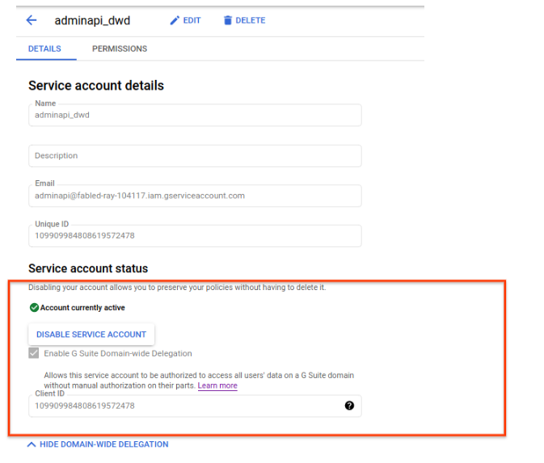
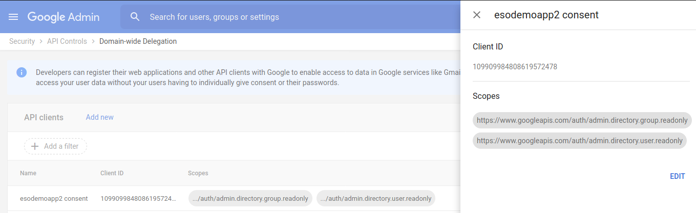

### Gsuites Domain Wide Delegation in golang


Sample application to list out the Google Gsuites User Posix group information using [GCP Directory API](https://developers.google.com/admin-sdk/directory)

This is intended to be used GCP VM OS-login:

- [https://cloud.google.com/compute/docs/oslogin/manage-oslogin-in-an-org#modify-users](https://cloud.google.com/compute/docs/oslogin/manage-oslogin-in-an-org#modify-users)


To use, you must download a service account, then grant its 'client_id' domain-wide delegation permissions, grant the _specific_ scopes to that client_id, then execute the sample to impersonate an actual admin

For reference, see

1. Determine client_id for ServiceAccount and enable domain delegation



2. Enable the scopes for the gsuites domain

  NOTE, the scopes you delcare here must **PRECISELY** match what you request in your API call.

  in this case, the scopes are

- `https://www.googleapis.com/auth/admin.directory.group.readonly`
- `https://www.googleapis.com/auth/admin.directory.user.readonly`

  

so when you bootstrap the client

```golang
	serviceAccountJSON, err := ioutil.ReadFile(*serviceAccountFile)
	if err != nil {
		log.Fatal(err)
	}

	config, err := google.JWTConfigFromJSON(serviceAccountJSON, admin.AdminDirectoryUserReadonlyScope,
		admin.AdminDirectoryGroupReadonlyScope)

	config.Subject = *adminEmail

	ctx := context.Background()

	srv, err := admin.New(config.Client(ctx))
	if err != nil {
		log.Fatal(err)
	}
```

3.  Impersonate an actual admin

DWD only allows you to impersonate another domain user.  

For us to do admin stuff, w're going to impersonate the admin user `config.Subject = *adminEmail`


---


- [Easy GSuites Domain-Wide Delegation (DwD) in Java](https://salmaan-rashid.medium.com/easy-gsuites-domain-wide-delegation-dwd-in-java-5abc7d08f1e1)
